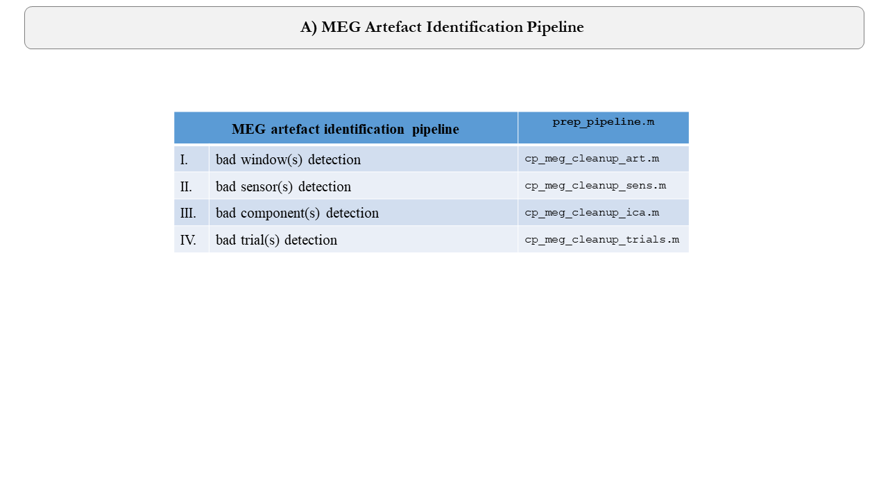
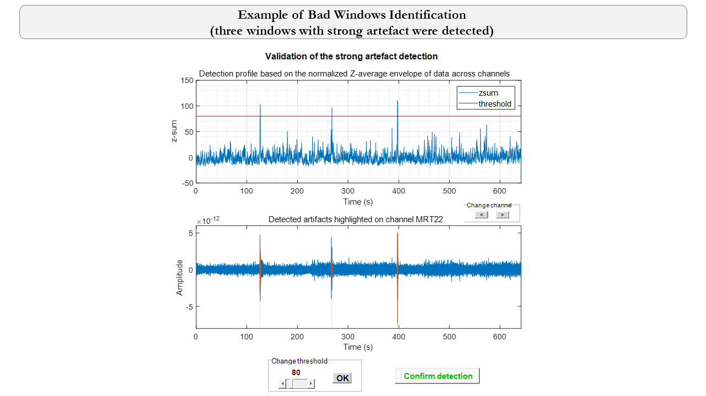

# Tracking Information Flow in Dynamic Communication in the Brain Networks: Optimal Localization of the Brain Sources ~~and Developing Functional Connectivity Approaches~~ using MEG

## Cortical (White matter, in-between, Pial) Dynamics Reconstructed using MEG (The Developed Toolbox Was Adapted from [pipelines-ilcb](https://github.com/brovelli/pipelines-ilcb))

## Developed Toolbox for Manually Selecting Multiple Spatial Priors, with Source Locations Shown in Black Dots and fMRI Activation in Yellow Cortex, in the Source Reconstruction Problem (Parametric Empirical Bayesian Framework using SPM)

## Tracking Information Flow in Dynamic Communication in the Brain Networks

# How to cite
* **F. Afdideh**, et al., "Tracking Information Flow in Dynamic Communication in the Brain Networks: Optimal Localization of the Brain Sources and Developing Functional Connectivity Approaches using MEG", to be published.
*	J. J. Bonaiuto, **F. Afdideh**, M. Ferez, K. Wagstyl, J. Mattout, M. Bonnefond, G. R Barnes, S. Bestmann, “Estimates of cortical column orientation improve MEG source inversion,” NeuroImage, vol. 216, p. 116862, Aug. 2020, doi: 10.1016/j.neuroimage.2020.116862.
